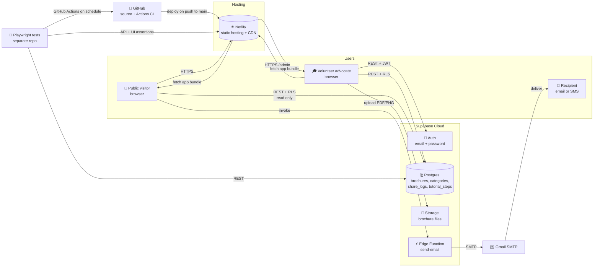
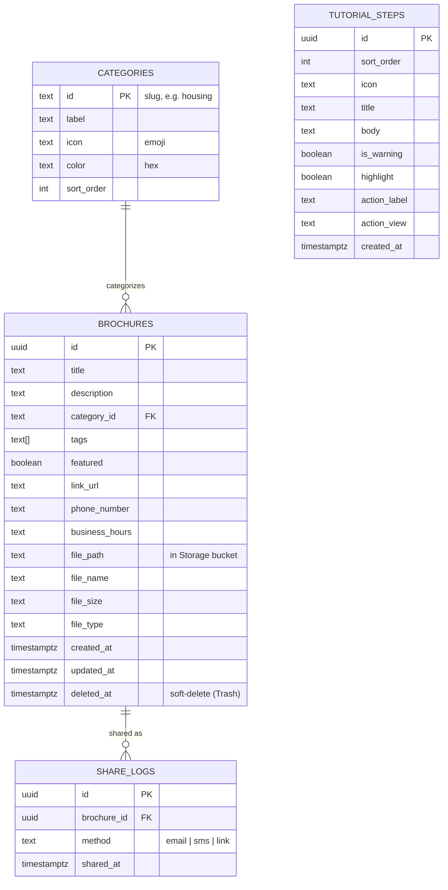
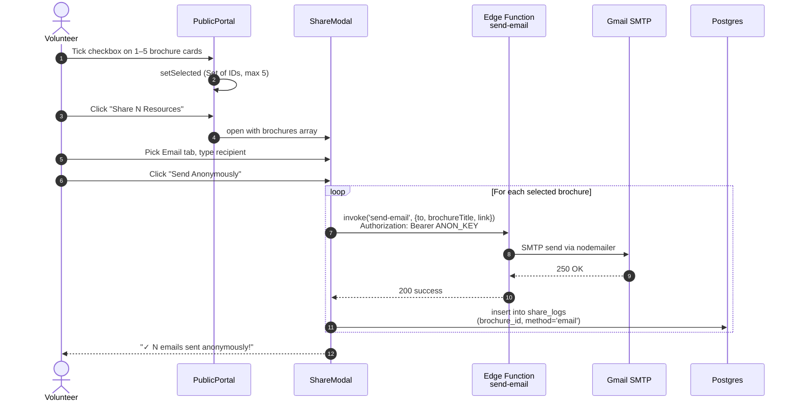

# Architecture

A short tour of how this app is wired together. Diagrams render on GitHub — no setup needed.

---

## 1. System context

The big picture: what talks to what.

### Notes

- **Netlify** auto-rebuilds from `main`; Supabase Edge Functions do **not** auto-deploy — they need a manual `supabase functions deploy`.
- **Row-Level Security (RLS)** on every table. Anonymous visitors can read non-deleted brochures and insert into `share_logs`; only authenticated users (volunteers/admins) can write to `brochures`, `categories`, and `tutorial_steps`.
- The **Edge Function** is the only path that touches Gmail SMTP — credentials never reach the browser.
- The **Playwright test repo** lives at [`appuuprety/victimsadvocate-test`](https://github.com/appuuprety/victimsadvocate-test) and runs smoke tests on every push, integration nightly, regression weekly.

---

## 2. Database schema

Tables that drive the app.

### Notes

- **`brochures.deleted_at`** is the soft-delete marker. The Trash tab in admin shows rows with this set; public views filter them out.
- **`tutorial_steps`** is editable from the admin "🎓 Tutorial" tab — it's not seeded into code, so anything can be changed without a deploy.
- **`share_logs`** records every share event for the Activity tab. No PII (no recipient address) — just the brochure ID and the channel used.

---

## 3. Sequence — Share a resource

What happens between the click on "Share" and the email landing in someone's inbox. The trickiest flow in the app.

### Notes

- The modal sends **one email per resource in parallel** (`Promise.all`) instead of one combined email. This is a workaround for the un-deployed Edge Function update — the existing function only knows how to format a single resource at a time.
- The **Authorization header** is required because Supabase Edge Functions reject unauthenticated calls by default. The anon key is safe to ship in the bundle (RLS does the actual gatekeeping).
- The **SMS tab** uses the same flow but routes through email-to-SMS gateways (`5551234567@vtext.com` etc.) instead of a real SMS provider, to keep cost zero.
- **Recipient address never reaches the database** — only the share method does. Privacy by design.

---

## Out of scope

What this doc deliberately doesn't cover:

- **Detailed component tree** — the React structure is small enough to read directly. See `src/components/`.
- **CSS / design tokens** — colors and shared style values live in [`src/components/ui.jsx`](../src/components/ui.jsx).
- **Translations strategy** — [`src/lib/translations.js`](../src/lib/translations.js) is the source of truth; non-English values are machine-translated and pending native-speaker review.
- **PWA / offline behavior** — see [`public/sw.js`](../public/sw.js); the gist is "cache app shell, never cache Supabase API calls."
